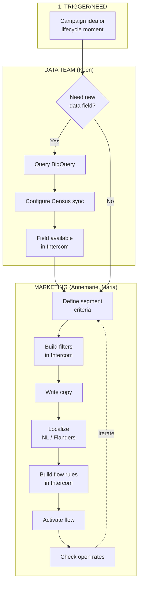

# As-Is Process Map: Draft from December Transcript

> Purpose: Pre-populated process stages for Friday dry run with Sander
> Source: December 12, 2025 kickoff transcript
> Status: DRAFT — needs validation

---

## Process Boundary

**Start:** Decision to create/update an audience segment
**End:** Flow is live and sending to users

**Out of scope (for now):** Performance analysis, flow retirement

---

## Swimlane Draft

### Columns (Stages)

```
1. Trigger/Need → 2. Data Pull → 3. Segment Build → 4. Content Create → 5. Flow Setup → 6. Activate → 7. Monitor
```

### Rows (Roles)

| Role | Person(s) | Systems |
|------|-----------|---------|
| Data | Koen | BigQuery, Census |
| Marketing/Intercom | Annemarie, Maria | Intercom |
| Content | Marketing team | Intercom, templates |

---

## Stage Details (From Transcript)

### 1. Trigger/Need
**What we know:**
- Trigger is often a campaign idea or lifecycle moment (onboarding, re-engagement, upsell)
- Sometimes triggered by noticing a gap ("these users aren't in any flow")

**Unknown:**
- Who initiates? Marketing? Product? Data insight?
- How formalized is the request?
- Is there a backlog of segment ideas?

---

### 2. Data Pull
**What we know:**
- Data lives in BigQuery
- Census syncs fields to Intercom
- "We can push any fields to Intercom" (Koen)
- Available: logins, lessons, Live Lessons, quizzes, tool usage, school affiliation

**Unknown:**
- How long does a new field take to add?
- Who requests new fields?
- Is there a data dictionary or self-serve?

---

### 3. Segment Build
**What we know:**
- Done in Intercom
- Currently attribute-based (grade level, region, plan tier)
- Manual filter creation
- 210 total segments/flows exist

**Unknown:**
- Time to create a segment?
- Who builds — Annemarie only or others?
- Is there a naming convention?
- How do they check for overlap with existing segments?

---

### 4. Content Create
**What we know:**
- Localization needed (NL vs Flanders Dutch)
- Templates exist but are rigid
- Personalization validated to improve open rates (correlation matrix experiment)

**Unknown:**
- Who writes copy?
- Review/approval process?
- How many variants per flow?
- Time per content piece?

---

### 5. Flow Setup
**What we know:**
- Flows built in Intercom
- Rules define entry/exit conditions
- 27 flows currently live (of 210 total)
- No overlap prevention ("users can be in multiple flows")

**Unknown:**
- Who configures flow logic?
- Testing process before activation?
- How are exit conditions defined (if at all)?

---

### 6. Activate
**What we know:**
- Manual activation in Intercom
- No mention of approval workflow

**Unknown:**
- Who approves?
- Is there a QA step?
- Rollout (all at once or phased)?

---

### 7. Monitor
**What we know:**
- "Poor analytics" — hard to see who's in what
- Can't easily detect overlap
- Coverage gaps exist but aren't visible

**Unknown:**
- What metrics do they check?
- How often?
- Who owns performance?
- What triggers a flow update or retirement?

---

## Mermaid Diagram



---

## Visual Draft (ASCII for Reference)

```
┌─────────────────────────────────────────────────────────────────────────────────────┐
│                                    STAGES                                            │
├──────────┬──────────┬──────────┬──────────┬──────────┬──────────┬──────────────────┤
│ Trigger  │ Data     │ Segment  │ Content  │ Flow     │ Activate │ Monitor          │
│          │ Pull     │ Build    │ Create   │ Setup    │          │                  │
├──────────┴──────────┴──────────┴──────────┴──────────┴──────────┴──────────────────┤
│ DATA (Koen)                                                                         │
│ ┌────────┐ ┌────────┐                                                               │
│ │Request │→│BigQuery│→ Census sync to Intercom                                      │
│ │new     │ │query   │                                                               │
│ │field?  │ │        │                                                               │
│ └────────┘ └────────┘                                                               │
├─────────────────────────────────────────────────────────────────────────────────────┤
│ MARKETING (Annemarie, Maria)                                                        │
│            ┌────────┐ ┌────────┐ ┌────────┐ ┌────────┐ ┌────────┐ ┌───────────────┐ │
│ Campaign ─→│Segment │→│Write   │→│Build   │→│Turn on │→│Check   │                 │
│ idea       │filters │ │copy    │ │flow    │ │flow    │ │open    │                 │
│            │Intercom│ │localize│ │rules   │ │        │ │rates?  │                 │
│            └────────┘ └────────┘ └────────┘ └────────┘ └────────┘                   │
└─────────────────────────────────────────────────────────────────────────────────────┘
```

---

## Known Pain Points (Overlay for Workshop)

| Stage | Pain | Source |
|-------|------|--------|
| Segment Build | No overlap check — users in multiple flows | Transcript |
| Segment Build | Manual, time-consuming | Transcript |
| Flow Setup | No exit conditions — users stay forever | Inferred |
| Monitor | Can't see coverage gaps | Transcript |
| Monitor | Poor analytics on who's in what | Transcript |
| Content | Localization burden (NL vs Flanders) | Transcript |

---

## Validation Questions for Friday Dry Run

1. **Is this the right sequence?** Any stages missing or out of order?
2. **Who does what?** Validate role assignments
3. **Where are the handoffs?** Data → Marketing, Marketing → Activate
4. **Time per stage?** Get rough estimates
5. **What breaks?** Failure modes per stage
6. **Where's the approval?** Is there one? Should there be?

---

## Gaps to Fill Monday

Even after Friday, we'll need the workshop to:
- Get time/effort estimates per step
- Validate pain points with the full team (not just Annemarie/Koen)
- Surface hidden steps ("oh yeah, we also do X")
- Identify AI opportunity points with the team's input

---

*Draft ready for Friday dry run with Sander*
