# To-Be Process Map: AI-Assisted Flow with Human Gates

> Purpose: Future state process showing AI intervention points
> Source: December 12 transcript + identified opportunities
> Status: DRAFT — for Monday workshop co-creation

---

## Process Boundary

**Start:** Decision to create/update an audience segment
**End:** Flow is live and sending to users

**Key Change:** AI assists at each stage, human approves at gates

---

## Mermaid Diagram

```mermaid
flowchart TB
    subgraph TRIGGER["1. TRIGGER/NEED"]
        T1[Campaign idea or<br/>lifecycle moment]
        AI_T1[/"AI: Surface coverage gaps<br/>AI: Flag users not in any flow"/]
    end

    subgraph DATA["DATA TEAM (Koen)"]
        D1{Need new<br/>data field?}
        D2[Query BigQuery]
        D3[Configure Census sync]
        D4[Field available<br/>in Intercom]
    end

    subgraph MARKETING["MARKETING (Annemarie, Maria)"]
        AI_M1[/"AI: Suggest audience consolidation<br/>AI: Show similar existing segments"/]
        M1[Define segment<br/>criteria]
        GATE1{Human<br/>approves<br/>segment?}

        M2[Build filters<br/>in Intercom]
        AI_M2[/"AI: Detect overlap with<br/>existing flows"/]

        AI_M3[/"AI: Draft content variants<br/>AI: Suggest personalization"/]
        M3[Write copy]
        M4[Localize<br/>NL / Flanders]
        GATE2{Human<br/>approves<br/>content?}

        M5[Build flow rules<br/>in Intercom]
        AI_M5[/"AI: Suggest exit conditions<br/>AI: Flag missing rules"/]

        GATE3{Human<br/>approves<br/>activation?}
        M6[Activate flow]

        AI_M7[/"AI: Real-time overlap alerts<br/>AI: Coverage dashboard"/]
        M7[Monitor performance]
    end

    %% Flow connections
    T1 --> AI_T1
    AI_T1 --> D1
    D1 -->|Yes| D2
    D2 --> D3
    D3 --> D4
    D4 --> AI_M1
    D1 -->|No| AI_M1

    AI_M1 --> M1
    M1 --> GATE1
    GATE1 -->|Yes| M2
    GATE1 -->|No| M1

    M2 --> AI_M2
    AI_M2 --> AI_M3
    AI_M3 --> M3
    M3 --> M4
    M4 --> GATE2
    GATE2 -->|Yes| M5
    GATE2 -->|No| M3

    M5 --> AI_M5
    AI_M5 --> GATE3
    GATE3 -->|Yes| M6
    GATE3 -->|No| M5

    M6 --> AI_M7
    AI_M7 --> M7
    M7 -.->|AI suggests<br/>optimizations| AI_M1

    %% Styling
    style AI_T1 fill:#e1f5fe
    style AI_M1 fill:#e1f5fe
    style AI_M2 fill:#e1f5fe
    style AI_M3 fill:#e1f5fe
    style AI_M5 fill:#e1f5fe
    style AI_M7 fill:#e1f5fe
    style GATE1 fill:#fff9c4
    style GATE2 fill:#fff9c4
    style GATE3 fill:#fff9c4
```



---

## AI Intervention Points

| Stage | AI Capability | Pain Point Addressed |
|-------|---------------|----------------------|
| **Trigger** | Surface coverage gaps, flag orphan users | Users falling through undetected |
| **Segment Build** | Suggest consolidation, show similar segments | 210 flows, overlap confusion |
| **Segment Build** | Detect overlap with existing flows | Users in multiple flows |
| **Content** | Draft variants, suggest personalization | Scaling without headcount |
| **Content** | Curriculum-aware suggestions (Dwayne's agent) | Generic messaging |
| **Flow Setup** | Suggest exit conditions | Users stuck forever |
| **Monitor** | Real-time overlap alerts, coverage dashboard | Poor analytics visibility |
| **Optimize** | Suggest consolidation based on performance | Continuous improvement |

---

## Human Gates (Approval Points)

| Gate | What Human Decides | AI Provides |
|------|-------------------|-------------|
| **GATE 1: Segment** | Is this the right audience? | Overlap report, similar segments, coverage impact |
| **GATE 2: Content** | Is messaging appropriate? | Draft variants, personalization suggestions |
| **GATE 3: Activation** | Ready to go live? | Checklist, overlap warning, exit condition status |

**Principle:** AI suggests, human confirms. No automated deployment.

---

## Swimlane Detail

### Rows (Roles) — Same as As-Is

| Role | Person(s) | Systems | AI Augmentation |
|------|-----------|---------|-----------------|
| Data | Koen | BigQuery, Census | Unchanged (data pipeline works) |
| Marketing/Intercom | Annemarie, Maria | Intercom | AI assistant for suggestions |

### Columns (Stages) — Enhanced

```
1. Trigger/Need    → 2. Data Pull → 3. Segment Build    → 4. Content Create → 5. Flow Setup     → 6. Activate      → 7. Monitor
   + AI coverage      (unchanged)    + AI consolidate      + AI draft          + AI exit rules     + Human gate      + AI dashboard
   gap alerts                        + AI overlap detect   + AI personalize                        + AI overlap
                                     + Human gate          + Human gate                            alert
```

---

## What Changes from As-Is

| As-Is Problem | To-Be Solution |
|---------------|----------------|
| Users fall through cracks | AI surfaces coverage gaps proactively |
| 210 overlapping flows | AI suggests consolidation, shows similar segments |
| Users in multiple flows | AI detects overlap before activation |
| No exit conditions | AI suggests exit rules, flags missing ones |
| Poor analytics | AI-powered coverage dashboard |
| Can't scale personalization | AI drafts content variants, curriculum-aware |
| Manual everything | AI assists, human approves (3-person team scales) |

---

## What Stays the Same

- **Intercom remains the platform** — no tool switch
- **BigQuery → Census → Intercom pipeline** — works fine
- **Human approval required** — firm requirement
- **3-person team** — AI augments, doesn't replace
- **Regional variants** — NL vs Flanders still needed

---

## Validation Questions for Monday

1. **Are these the right AI intervention points?** Any we missed?
2. **Are three gates enough?** Or do we need more/fewer checkpoints?
3. **Which AI capability is highest priority?** Overlap detection? Coverage gaps? Content drafts?
4. **Integration with Dwayne's agent?** Ready for curriculum-aware personalization?
5. **What does the dashboard need to show?** Coverage, overlap, performance?

---

## MVP Scope (Sprint Deliverable)

If we can only build one thing this sprint:

| Option | Impact | Effort |
|--------|--------|--------|
| **Coverage dashboard** | See gaps for first time | Medium |
| **Overlap detector** | Stop active harm | Medium |
| **Segment consolidation tool** | Reduce 210 → manageable | High |
| **Content draft assistant** | Scale personalization | Medium |

**Recommendation:** Overlap detector + Coverage dashboard (P0 from COPE assessment)

---

## Comparison: As-Is vs To-Be

```
AS-IS (Current)                          TO-BE (With AI)
─────────────────                        ────────────────
Campaign idea                            Campaign idea
    │                                        │
    ▼                                        ▼
Need new field? ──Yes──► BigQuery        AI: "12% of users not in any flow"
    │                        │               │
    No                       ▼               ▼
    │                    Census           Need new field? ──► (same)
    ▼                        │               │
Build segment manually       ▼               ▼
    │                    Intercom         AI: "Similar to 3 existing segments"
    │                                        │
    ▼                                        ▼
Write copy                               Human approves segment
    │                                        │
    ▼                                        ▼
Localize (manual)                        AI: "Overlaps with 2 flows"
    │                                        │
    ▼                                        ▼
Build flow rules                         AI drafts content + variants
    │                                        │
    ▼                                        ▼
Activate (no checks)                     Human approves content
    │                                        │
    ▼                                        ▼
Check open rates (limited)               AI suggests exit conditions
    │                                        │
    ▼                                        ▼
??? (no visibility)                      Human approves activation
                                             │
                                             ▼
                                         AI dashboard: coverage + overlap
```

---

*Draft ready for Monday workshop co-creation with team*
