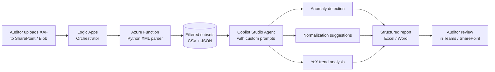

# Use Case 6 — Auditfiles: Architecture Discussion

**Workshop:** Tatoma × Crowe Foederer — Project Faraday
**Date:** Tuesday, April 14, 2026
**Session length:** 20 minutes (5 + 10 + 5)
**Platform target:** Microsoft / Copilot Studio stack
**Feasibility:** Medium — highest long-term value, highest engineering effort of the six use cases.

---

## 1. The Challenge (5 min)

### The scale problem

KleurRijker's Exact Online export produces four XAF 3.2 files covering fiscal years 2022–2025:

| Year | File size | Transactions | GL lines | Subledger lines |
|------|-----------|--------------|----------|------------------|
| 2022 | 63 MB | 13,383 | 66,730 | 13,078 |
| 2023 | 76 MB | 17,202 | 83,919 | 16,401 |
| 2024 | 86 MB | 19,243 | 95,509 | 19,064 |
| 2025 | 88 MB | 20,077 | 98,694 | 19,724 |

Volume is growing ~50% over the four years. A single 2025 file expands to roughly **800K+ tokens** when parsed as XML — comparable to several novels of structured text.

### Why direct upload does not work (in any AI)

This is not a Claude-only or Copilot-only limit. It is a physics-of-LLMs limit:

- **Context window ceilings.** Frontier models (Claude Sonnet/Opus 4.x, GPT-4.1, Gemini 2.5) max out around 200K–1M tokens. One XAF year consumes 600K–900K tokens on its own; four years would never co-exist in any single prompt.
- **Signal-to-noise.** Even if a model *could* ingest 99K GL lines, attention degrades long before the hard limit. Relevant anomalies get lost in the mass of routine postings.
- **Cost and latency.** A full-file prompt would cost tens of euros per run and take minutes per turn — not viable for an interactive audit workflow.
- **XML verbosity.** XAF is tag-heavy (`<trLine>`, `<amnt>`, `<desc>` …). 60–70% of the bytes are structural, not analytic content.

The conclusion is not "use a bigger model." It is **"pre-filter the data before the model sees it."** Any AI platform — Claude, Copilot, GPT, Gemini — needs this pipeline.

### What Crowe wants the AI to do

Based on Bram's brief:

- **Flag notable items:** unusual transactions, round numbers, manual journals, year-end corrections, duplicates, missing document refs.
- **Suggest normalizations:** owner compensation, one-offs, related-party, accrual timing, non-recurring narratives.
- **Cross-year trend analysis:** revenue/cost trajectories, customer & supplier concentration, account balance jumps.

None of these require the model to see every line — they require the model to see **the right lines**.

---

## 2. Proposed Architecture (10 min)

### The pipeline

```
┌──────────────┐   ┌────────────────┐   ┌────────────────┐   ┌──────────────┐   ┌────────────────┐
│  XAF files   │──▶│  Preprocessing │──▶│ Filtered       │──▶│ AI analysis  │──▶│ Structured     │
│  (4 × ~80MB) │   │  (Azure Func)  │   │ subsets        │   │ (Copilot     │   │ report         │
│  Blob Storage│   │  XML → filters │   │ CSV / JSON /   │   │  Studio)     │   │ (.xlsx / .docx)│
└──────────────┘   └────────────────┘   │ Parquet        │   └──────────────┘   └────────────────┘
                           ▲            └────────────────┘           ▲
                           │                    │                    │
                           │            ┌────────────────┐           │
                           └────────────│ Logic Apps     │───────────┘
                                        │ orchestrator   │
                                        └────────────────┘
```

### Mermaid version (for later copy-into-Confluence)



### Step-by-step

**1. Ingest.** Auditor drops the four XAF files into a SharePoint library or an Azure Blob Storage container. A trigger (Logic Apps or Blob event) picks them up.

**2. Preprocessing.** Four Microsoft-native options, with trade-offs:

| Option | Best when | Watch-out |
|--------|-----------|-----------|
| **Azure Function (Python)** | XML parsing with `lxml.iterparse`, custom filter logic, fastest to build | Needs a developer to own the repo; not low-code |
| **Power Automate + custom connector** | Business users want a no-code trigger/flow | Struggles with 88 MB XML; timeouts and memory limits realistic |
| **Azure Data Factory** | This becomes a repeatable ETL across many clients | Heavier setup; XAF parsing still needs a custom activity |
| **Logic Apps (orchestrator only)** | Coordinating the pieces above and notifying users | Not the parser itself — delegates to a Function |

**Honest recommendation:** *Azure Function in Python, orchestrated by Logic Apps.* Power Automate and ADF are tempting for "low-code" optics but XAF 3.2 parsing at this file size wants streaming XML with `iterparse` (or SAX), which is firmly developer territory. Starting with a Function keeps the MVP small; graduate to ADF later if this becomes a multi-client pipeline.

**3. Filters — what the Function extracts.** Each filter produces its own small CSV/JSON artifact:

- `manual_entries.csv` — all postings where journal type = "Memoriaal" (or equivalent) **with non-empty narratives**. These are where humans intervened.
- `large_transactions.csv` — lines with `|amount| > EUR X` (threshold configurable, EUR 5K or EUR 10K per Bram's call).
- `period_13_entries.csv` — closing-period postings (accruals, year-end adjustments, cut-off).
- `balance_by_account_yoy.csv` — aggregated debit/credit per GL code per year across all four files — the trend table.
- `flagged_accounts.csv` — lines whose GL code matches a watch-list (management fees, related-party, intercompany, loans to shareholders). This list should come from Crowe.
- `metadata.json` — row counts, totals, hash of input file for reproducibility.

Rough reduction: the four 80 MB files (~3M XML lines total) collapse to a few hundred KB of relevant rows — comfortably within any AI's context window.

**4. AI analysis layer (Copilot Studio).** One agent, multiple topics:

- Topic: **Anomaly detection** — prompt the agent with `manual_entries.csv` + `large_transactions.csv`, ask it to rank lines by suspicion (round numbers, weekend dates, narratives like "correctie", "dubbel", "tbv", counterparties that appear only once).
- Topic: **Normalization suggestions** — feed `flagged_accounts.csv` + narrative samples, ask for owner comp, one-offs, related-party candidates to present to the auditor.
- Topic: **Trend analysis** — feed `balance_by_account_yoy.csv`, ask for material YoY swings with plausible explanations.
- Knowledge sources: Crowe's own normalization checklist (once Bram shares it), plus a glossary of Dutch GL code ranges.

**5. Output.** The agent emits a structured report — our recommendation is a Word memo (`.docx`) with embedded tables for the auditor's working papers, plus a companion `.xlsx` that lists every flagged line with columns for **Auditor decision** (Accept / Reject / Follow up) and **Normalization amount**. Saved back to SharePoint alongside the source XAFs.

### Where custom development is genuinely required

Being honest about this matters for the timeline conversation:

- **XAF parser.** No off-the-shelf Microsoft connector reads XAF 3.2. Custom Python with `lxml` — roughly 300–500 lines.
- **Filter logic.** Each of the six filters is straightforward individually but needs a domain review with Crowe to confirm thresholds and account-code mappings.
- **Prompt engineering.** The Copilot Studio topics need real iteration against actual KleurRijker data — not a one-afternoon build.
- **Report template.** The `.docx`/`.xlsx` output template must match Crowe's existing working-paper format or auditors will not adopt it.

Everything else (storage, orchestration, triggers, auth, notifications) is off-the-shelf Azure/M365.

---

## 3. Where Does This Live in Crowe's Stack? (5 min)

### Who maintains the preprocessing logic?

Two viable models:

- **Option A — Crowe Technology team owns it.** The Function and filter configs live in a Crowe-managed Azure subscription. Tatoma hands over repo + runbook after the pilot. Best for long-term fit, requires Crowe to have (or grow) Python skills on the Technology team.
- **Option B — Tatoma operates it as a managed service.** Crowe uploads files, we return the filtered artifacts and the Copilot Studio agent. Faster to start, creates vendor dependency.

Our recommendation: **start with B for the MVP, migrate to A once the filter set is stable.** This lets the M&A advisory team validate value before Crowe Technology commits headcount.

### Integration with the existing audit workflow

The pipeline should bolt onto what auditors already do, not replace it:

- Files already land in SharePoint / a client folder — use that as the trigger, not a new upload portal.
- Output lives next to the source XAFs in the same client folder, visible to the whole engagement team.
- Flagged items flow into the existing normalization working paper (the same Excel Crowe uses today), not a new tool.
- Copilot Studio agent is reachable from Teams — auditors can ask follow-up questions ("show me all postings from account 4010 above 10K in Q4") without leaving their chat client.

### One-off tool or repeatable pipeline?

This is the design decision that sets the ceiling on value:

- **One-off** — we build it for Project Faraday, learn, and discard. Lowest cost, lowest reuse.
- **Repeatable pipeline** — same Function, same filters, works for any Exact Online client because XAF 3.2 is a standard. Every subsequent M&A engagement gets the same preprocessing for free.

XAF 3.2 is a Dutch standard (Belastingdienst-mandated for Exact, AFAS, Twinfield and others). Built once, this pipeline compounds across Crowe's M&A book. **The repeatable version is where the business case lives.**

### Realistic MVP timeline

| Phase | Scope | Effort |
|-------|-------|--------|
| **Week 0** | Workshop output — filter shortlist, thresholds, GL code map confirmed with Bram | in-session |
| **Weeks 1–2** | Azure Function v1 parsing one XAF, producing `manual_entries`, `large_transactions`, `balance_by_account_yoy` | ~1 dev-week |
| **Week 3** | Copilot Studio agent v1 with the three topics, tested against KleurRijker 2024 | ~3 dev-days |
| **Week 4** | Output template (`.docx` + `.xlsx`), Logic Apps orchestrator, SharePoint trigger | ~3 dev-days |
| **Weeks 5–6** | Internal pilot on Project Faraday — auditors use it live, feedback loop | ongoing |
| **Weeks 7–8** | Harden for second client, add `period_13` + `flagged_accounts` filters, handover docs | ~1 dev-week |

**Total MVP:** ~6–8 weeks, ~3 dev-weeks of build, the rest validation. This is realistic only if Crowe can provide the normalization checklist and GL code map in Week 0.

---

## Discussion prompts for the room

1. What is the materiality threshold Crowe actually uses — EUR 5K, 10K, 25K, or a percentage of revenue?
2. Do we have the GL code map for management fees, related-party, intercompany today, or do we need a separate session?
3. Is there appetite for Crowe Technology to own the Function long-term, or does "managed service" fit better for 2026?
4. Which Copilot Studio environment (tenant / sandbox) do we build the agent in for the pilot?
5. If this works, which client engagement after Project Faraday would be the second pilot?
